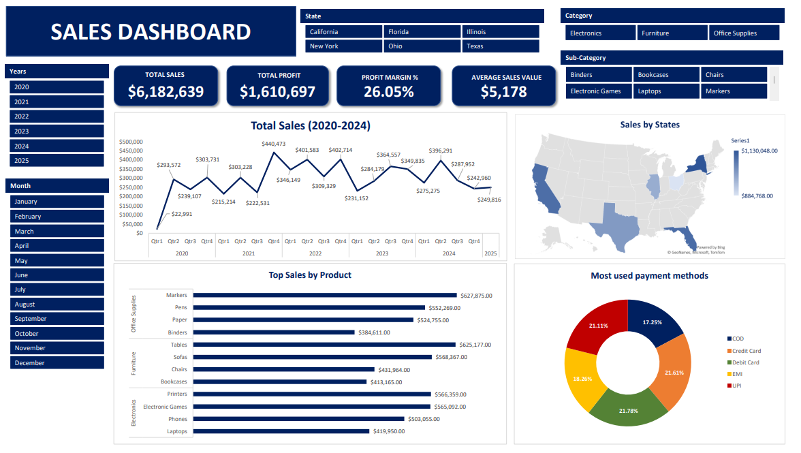
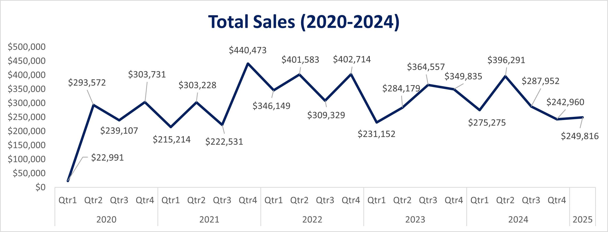
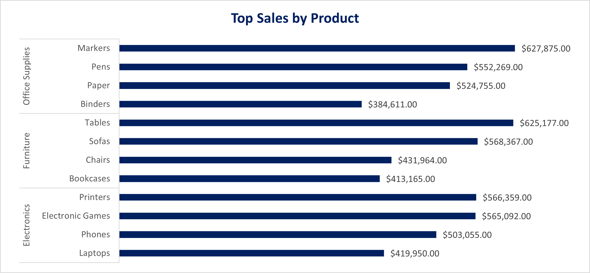
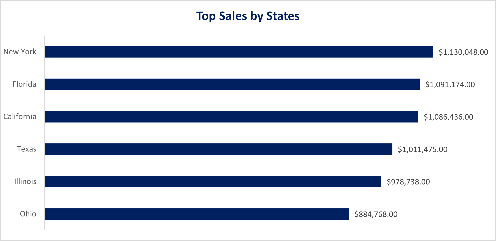
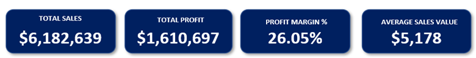

# Retail-Sales-Analysis-2020-2024

## Table of Contents

- [Project Background](#project-background)
- [Executive Summary](#executive-summary)
- [Data Structure](#data-structure)
- [Insights Deep-Dive](#insights-deep-dive)
    - [Sales Trends](#sales-trends)
    - [Product Performance](#product-performance)
    - [State Insights](#state-insights)
    - [Profitability](#profitability)
- [Recommendations](#recommendations)
- [Assumptions and Caveats](#assumptions-and-caveats)

***

## Project Background

This project is an analysis of retail sales history for over four years (2020–2024) from the Kaggle data source. The data includes an order-level transaction details with revenue, profit, product category, customer, and state-level breakdowns. Overall, the company generated sales of $6.18M and a profit of $1.61M with a 26% profit margin. The purpose of this project analysis is to uncover the sales drivers, product category performance, and geographical contributions in order to facilitate data-driven strategic business decisions. The result of analysis would benefit the Sales team, Product team, and Regional Managers. 

Download the excel dashboard [here](https://github.com/dev-cass/Retail-Sales-Analysis-2020-2024/blob/deba5a5bd7bd49077af8ab1c85e978f1c45b6dd6/Sales%20Dashboard.xlsx)

## Executive Summary

Between 2020 and 2024, the retail company has produced $6.18M sales and $1.61M profit, with a strong 26.05% margin reflecting strong pricing and cost management. The sales implied a cycle-based performance as 2020 through 2022 the sales are consistent, it peaked in Q4 2021, and surged again in 2024, and before it showed the signs of decline. Office supplies performed consistently as the top category and followed by furniture, while Electronics are underperforming across the period despite its strong sales in Texas. The regional level shows New York performed well, while California dominated in furniture, while Ohio has the least contribution. The average order value (AOV) at $5,178 indicates mid- and high-value transaction opportunities with chances of bundling, upselling, and loyalty strategies.

## Data Structure

`Order ID` – Unique identifier

`Amount` – Revenue per order 

`Profit` – Net profit per order 

`Quantity` – Units sold 

`Category` – High-level product grouping (categorical: Furniture, Technology, Office Supplies).  

`Sub-Category` – Detailed product segmentation 

`Payment Mode` – Customer payment method

`Order Date` – Transaction date 

`Customer Name` – Customer placing the order 

`State` – Customer’s state 

`City` – Customer’s city   

## Insights Deep-Dive

### Sales Trends 

- Sales grew steadily from 2020 to 2022, **peaking in Q4 2021**.  
- Another surge occurred in 2024, followed by a decline, suggesting cyclical performance.  
- Total sales reached **$6.18M**, with profitability at **$1.61M**.

### Product Performance

- **Office Supplies** consistently led in both sales and profit.  
- **Furniture** ranked second, with strong sales in California.  
- **Electronics** underperformed overall, but **Texas emerged as a key growth market**.

### State Insights

- **New York** consistently delivered the highest sales across categories.  
- **California** dominated in Furniture.  
- **Texas** was strongest in Electronics.  
- **Ohio** contributed the least to overall sales.

### Profitability

- Maintained a healthy **26.05% profit margin**.  
- **AOV of $5,178** shows mid- to high-value transactions, enabling expansion via **upselling, bundling, and loyalty programs**.  

## Recommendations

### Product Strategy

- Strengthen **Office Supplies** by expanding SKUs and introducing premium options.  
- Improve **Electronics performance** through bundling with Office Supplies or targeted promotions.  

### Customer & Market Growth

- Use **New York as a test market** for new product launches.  
- Investigate **Ohio’s underperformance** with market research and promotions.  
- Develop **segmentation and loyalty programs**, given the high AOV customer base.  

### Payment & Checkout Optimization

- With **Debit Card as the dominant payment mode**, streamline digital checkout experiences.  
- Promote **alternative payments** (e.g., credit card offers, UPI) to reduce reliance on a single option.  

### Profitability & Pricing

- Maintain strong **~26% margins** while reviewing discount policies.  
- Encourage **bulk purchases and subscription-style offers** to leverage the high AOV.  

## Assumptions and Caveats

- Dataset is **synthetic (sourced from Kaggle)** and may not reflect real-world seasonality.  
- City-level insights were available but not deeply explored.  
- No marketing or promotional variables included, limiting campaign effectiveness analysis.  
- Customer demographics (age, gender, income) not available, restricting profiling beyond geography.  

